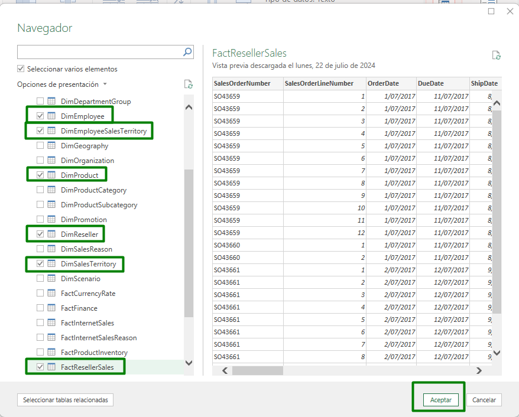
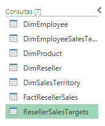
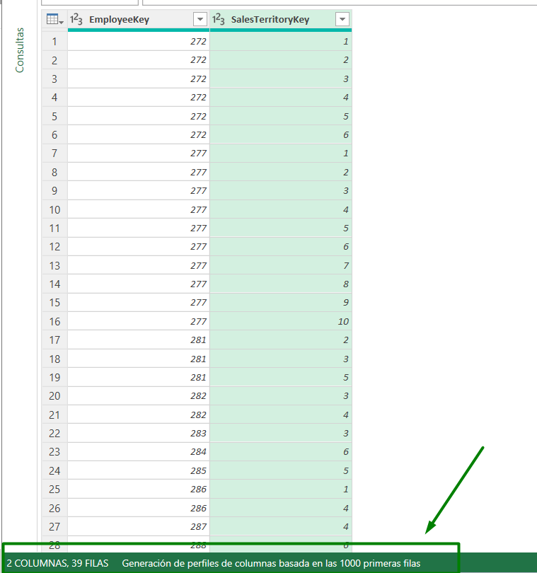
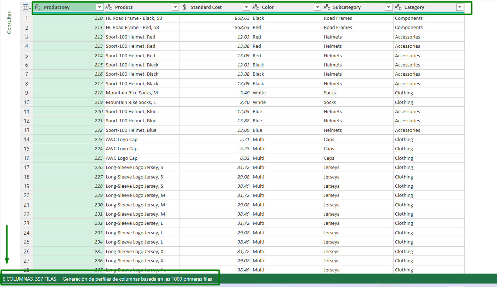
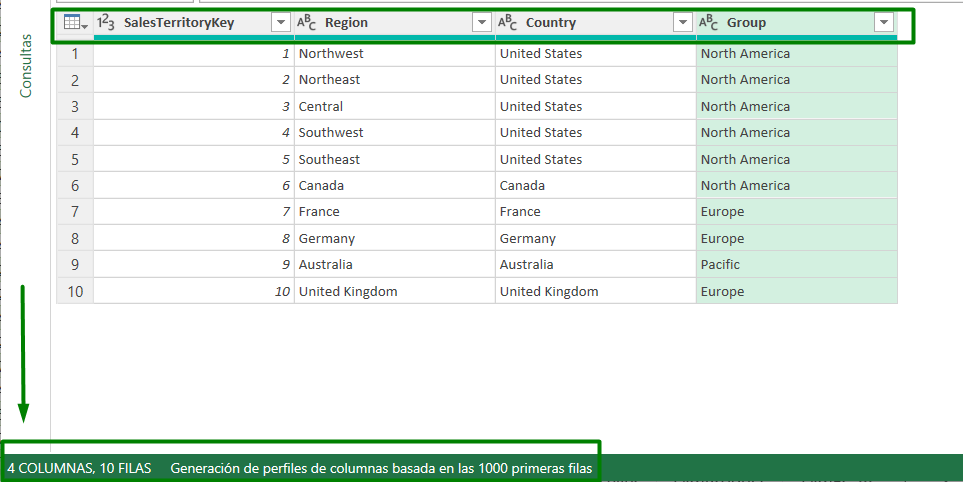
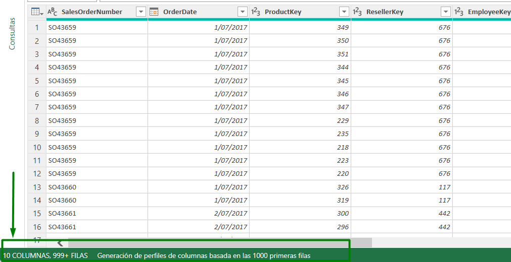
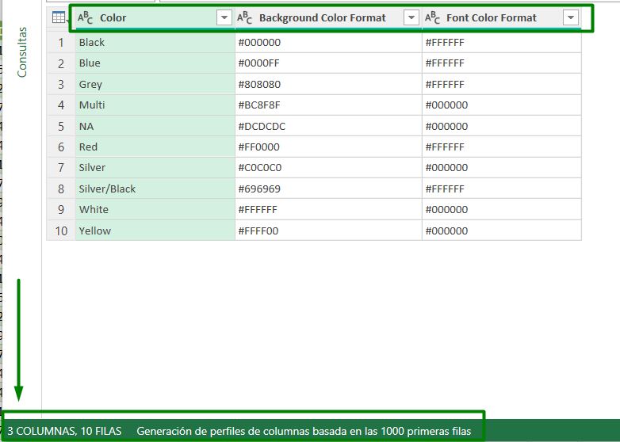
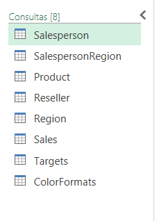
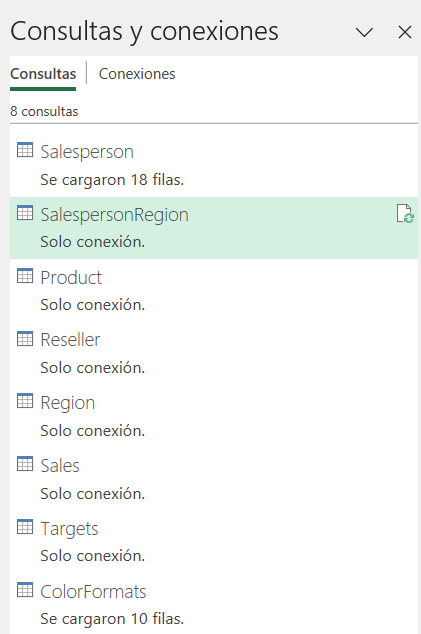

# Carga y transformación de datos en Power Query
Dentro de esta práctica nos conectaremos a una base de datos SQL Server que contiene diferentes tablas que buscamos transformar para posteriormente cargarlas. Iniciaremos conectándonos a diferentes fuentes de datos, luego visualizaremos los datos de origen utilizando Power Query, y haremos uso de las características de generación de perfiles de datos en Power Query para asegurarnos de que los datos estén listos para su transformación y análisis.

## Objetivo de la práctica:
Al finalizar la práctica, serás capaz de:

- Conectarse a diferentes fuentes de datos
- Tener una vista previa de los datos de origen.
- Utilizar características de generación de perfiles de datos
- Aplicar varias transformaciones comunes
- Cargar datos a Excel

## Duración aproximada:
- 120 minutos.

## Instrucciones 

### Tarea 1. Obtención de datos de SQL Server

- Paso 1.	Inicie la aplicación de Excel en su computadora.

- Paso 2.	En la cinta superior de Excel, haga clic en la pestaña **"Datos"** para acceder a las herramientas de gestión de datos.

- Paso 3.	Dentro de la pestaña **"Datos"**, busque el grupo **"Obtener y Transformar Datos"**.

- Paso 4.	Haga clic en el botón **"Obtener Datos"**.

- Paso 5.	En el menú desplegable, seleccione **“Iniciar el Editor de Power Query”**:

     

- Paso 6. En la nueva ventana del Editor de Power Query, en la pestaña de **“Inicio”** busque el grupo **“Nueva consulta”**.

- Paso 7. Seleccione **“Nuevo Origen” > “Bases de datos” > “SQL Server”**:

     

- Paso 8.	En la nueva ventana solo debe ingresar la información del servidor y luego seleccione **“Aceptar”**:

     

- Paso 9. En el panel Navegador, expanda la base de datos **AdventureWorksDW2020** y seleccione la opción **"Seleccionar varios elementos"** en la parte superior para poder elegir varias tablas al mismo tiempo.

- Paso 10. Para importar los datos de la tabla, seleccione la casilla de verificación situada junto a las siguientes tablas y luego seleccione **Aceptar**:

        • DimEmployee
        • DimEmployeeSalesTerritory
        • DimProduct
        • DimReseller
        • DimSalesTerritory
        • FactResellerSales

     

Ahora se ha conectado a seis tablas de una base de datos de SQL Server.

### Tarea 2. Vista previa de datos en Power Query Editor

Esta tarea le permite revisar y generar perfiles de los datos. Esto le ayuda a determinar cómo limpiar y transformar los datos más adelante. También revisará las tablas de dimensiones con el prefijo "Dim" y las tablas de hechos con el prefijo "Fact".

- Paso 1.En la ventana Editor de Power Query, a la izquierda, observe el panel Consultas. El panel Consultas contiene una consulta para cada tabla que ha seleccionado:

     

- Paso 2. Seleccione la primera consulta: **DimEmployee**.

- Paso 3. En la esquina inferior izquierda de la barra de estado, se proporcionan algunas estadísticas de la tabla: la tabla tiene 33 columnas y 296 filas:

     

- Paso 4. En el panel de vista previa de datos, desplácese horizontalmente para revisar todas las columnas. Observe que las últimas cinco columnas contienen vínculos de tabla o valor.

  >  *-- Estas cinco columnas representan relaciones con otras tablas de la base de datos. Se pueden utilizar para unir tablas.--*

- Paso 5. Para evaluar la calidad de la columna, en la pestaña **Vista** de la cinta de opciones, desde el grupo **Vista previa de datos**, active **Calidad de la columna**. La característica de calidad de columna le permite determinar fácilmente el porcentaje de valores válidos, de error o vacíos que se encuentran en las columnas.

     

- Paso 6. Observe que la columna **Posición** tiene un 94% de filas vacías (nulas).

     

- Paso 7. Para evaluar la distribución de columnas, en la pestaña **Vista** de la cinta de opciones, desde el grupo **Vista previa de datos**, active **Distribución de columnas**.

- Paso 8. Vuelva a revisar la columna **Posición** y observe que hay cuatro valores distintos y un valor único.

- Paso 9. Revise la distribución de columnas de la columna **EmployeeKey**: hay 296 valores distintos y 296 valores únicos.

     

- Paso 10. En el panel Consultas, seleccione la consulta **DimProduct**. 
   > *La tabla contiene una fila por producto vendido por la empresa.*

- Paso 11. En el panel **Consultas**, seleccione la consulta **DimReseller**.
    >*La tabla contiene una fila por revendedor. Los revendedores venden, distribuyen o agregan valor a los productos de Adventure Works*.

- Paso 12. Para ver los valores de columna, en la pestaña **Vista** de la cinta de opciones, desde el grupo **Vista previa de datos**, active **Perfil de columna**.

- Paso 13. Seleccione el encabezado de la columna **BusinessType** y observe el nuevo panel debajo del panel de vista previa de datos. Revise las estadísticas de columna y la distribución de valores en el panel de vista previa de datos.

    > *Observe el problema de la calidad de los datos: hay dos etiquetas para warehouse (Warehouse y Ware House mal escrito).*

     

- Paso 14. Coloque el cursor sobre la barra de **Ware House** y observe que hay cinco filas con este valor.

- Paso 15. En el panel **Consultas**, seleccione la consulta **DimSalesTerritory**.
    >*La tabla contiene una fila por región de ventas, incluida la sede central corporativa. Las regiones se asignan a un país y los países se asignan a grupos.*

- Paso 16. En el panel Consultas, seleccione la consulta **FactResellerSales**.
    >*La tabla contiene una fila por línea de pedido de ventas: un pedido de ventas contiene uno o varios elementos de línea*.

- Paso 17. Revise la calidad de la columna **TotalProductCost** y observe que el 8 % de las filas están vacías.
    >*La falta de valores de columna es un problema de calidad de los datos.*

     

### Tarea 3. Obtención de datos de un archivo CSV

- Paso 1. Para agregar una nueva consulta, en la ventana **Editor de Power Query**, en la pestaña de la cinta de opciones **Inicio**, en el grupo **Nueva consulta**, seleccione la flecha abajo **Nuevo origen** y, a continuación, seleccione **Texto/CSV**.

     

- Paso 2. Navegue hasta el archivo de **> ResellerSalesTargets.csv** *(Debería estar en una carpeta en el escritorio)*.  Seleccione **Importar**.

- Paso 3. En la ventana **ResellerSalesTargets.csv**, revise los datos de vista previa. Seleccione **Aceptar**.

- Paso 4. En el panel **Consultas**, observe la adición de la consulta **ResellerSalesTargets**.

- Paso 5. Tenga en cuenta que ninguna columna contiene valores vacíos. Cuando no hay un objetivo de ventas mensual, se almacena un guión en su lugar.

- Paso 6. Revise los iconos de cada encabezado de columna, a la izquierda del nombre de la columna. Los iconos representan el tipo de datos de la columna. **123** es un número entero y **ABC** es un texto.

- Paso 7. Repita los pasos para crear una consulta basada en el archivo **ColorFormats.csv**.
    >*El archivo CSV ColorFormats contiene una fila por color de producto. Cada fila registra los códigos HEX para formatear los colores de fondo y fuente.*

    Ahora debería tener dos nuevas consultas, **ResellerSalesTargets** y **ColorFormats**.

     

### Tarea 4. Configurar la consulta del Salesperson

- Paso 1. En el panel Consultas, seleccione la consulta **DimEmployee**

- Paso 2. Para cambiar el nombre de la consulta, en el panel **Configuración de consulta (ubicado a la derecha)**, en el cuadro **Nombre**, reemplace el texto por **Salesperson** y, a continuación, presione **Enter**. A continuación, compruebe que el nombre se ha actualizado en el panel **Consultas**.

- Paso 3. Para localizar una columna específica, en la pestaña de la cinta de opciones **Inicio**, en la sección de **Administrar columnas**, seleccione la flecha abajo de **Elegir columnas** y, a continuación, seleccione **Ir a columna**.

     

- Paso 4. Busque la columna **SalesPersonFlag** y, a continuación, filtre la columna para seleccionar solo **Salespeople** (es decir, **TRUE**) y haga clic en **Aceptar**.

     

- Paso 5. En el panel derecho de la **Configuración de consulta**, en la lista **Pasos aplicados**, observe que se agrego el paso **Filas filtradas**.

    >*Cada transformación que se crea da como resultado un paso aplicado. Es posible editar o eliminar pasos. También es posible seleccionar un paso para obtener una vista previa de los resultados de la consulta en esa etapa de la transformación de la consulta.*

     

- Paso 6. Para quitar columnas, en la pestaña de **Inicio**, seleccione el grupo **Administrar columnas**, seleccione el icono **Elegir columnas**.

- Paso 7. En la ventana **Elegir columnas**, para desmarcar todas las columnas, desactive el elemento **(Seleccionar todas las columnas)**.

- Paso 8. Para incluir columnas, marque las seis columnas siguientes:

        • EmployeeKey
        • EmployeeNationalIDAlternateKey
        • FirstName
        • LastName
        • Title
        • EmailAddress

- Paso 9. En la lista **Pasos aplicados**, observe la adición de otro paso de consulta.

     

- Paso 10. Para crear una columna de nombre único, seleccione primero el encabezado de la columna **FirstName**. Mientras presiona la tecla **Ctrl**, seleccione la columna **LastName**.

     

- Paso 11. Haga clic con el botón derecho en cualquiera de los encabezados de columna seleccionados, a continuación, en el menú, seleccione **Combinar columnas**.

    >*Muchas transformaciones comunes se pueden aplicar haciendo clic con el botón derecho en el encabezado de la columna y, a continuación, eligiéndolas en el menú. Tenga en cuenta, sin embargo, que hay más transformaciones disponibles en la cinta de opciones superior.*

- Paso 12. En la ventana **Combinar columnas**, en la lista desplegable **Separador**, seleccione **Espacio**.

- Paso 13. En el cuadro **Nuevo nombre de columna**, reemplace el texto por **Salesperson**.

     

- Paso 14. Para cambiar el nombre de la columna **EmployeeNationalIDAlternateKey**, haga doble clic en el encabezado de la columna **EmployeeNationalIDAlternateKey** y reemplace el texto por **EmployeeID** y, a continuación, presione **Entrar**.

- Paso 15. Use los pasos anteriores para cambiar el nombre de la columna **EmailAddress** a **UPN**.

    >*UPN es un acrónimo de nombre principal de usuario.*

- Paso 16. En la parte inferior izquierda, en la barra de estado, compruebe que la consulta tiene 5 columnas y 18 filas.

     

### Tarea 5. Configuración de la consulta SalespersonRegion

- Paso 1. En el panel Consultas, seleccione la consulta **DimEmployeeSalesTerritory**.

- Paso 2. En el panel **Configuración de consultas**, cambie el nombre de la consulta a **SalespersonRegion**.
- Paso 3. Para quitar las dos últimas columnas, primero seleccione el encabezado de columna **DimEmployee** y luego con **Ctrl** seleccione el encabezado de la columna **DimSalesTerritory**.

- Paso 4. Con las dos columnas seleccionadas, haga clic con el botón derecho y seleccione **Quitar columnas**.
      

- Paso 5. En la barra de estado, compruebe que la consulta tiene 2 columnas y 39 filas.
      

### Tarea 6. Configurar la consulta del Product

- Paso 1. Seleccione la consulta **DimProduct** y cambie el nombre de la consulta a **Product**.

- Paso 2. Busque la columna **FinishedGoodsFlag** y, a continuación, filtre la columna para recuperar los productos que son productos terminados (es decir, **TRUE**).

      

- Paso 3. Elimine todas las columnas, excepto las siguientes:

        • ProductKey (Clave de producto)
        • EnglishProductName
        • StandardCost
        • Color
        • DimProductSubcategory

      

- Paso 4. Observe que la columna **DimProductSubcategory** representa una tabla relacionada (contiene vínculos).

- Paso 5. En el encabezado de la columna **DimProductSubcategory**, a la derecha del nombre de la columna, seleccione el botón **expandir**.

- Paso 6.Consulta la lista completa de columnas y, a continuación, selecciona la casilla **"Seleccionar todas las columnas"** para anular la selección de todas las columnas.

- Paso 7. Seleccione **EnglishProductSubcategoryName** y **DimProductCategory**, y desactive la casilla **Usar el nombre de la columna original como prefijo** antes de seleccionar **Aceptar**.

      

- Paso 8. Observe que la transformación dio como resultado la adición de dos columnas y que se ha quitado la columna **DimProductSubcategory**.

- Paso 9. Expanda la columna **DimProductCategory** y, a continuación, introduzca solo la columna **EnglishProductCategoryName**.

      

- Paso 10. Cambie el nombre de las siguientes cuatro columnas siguientes:

        • EnglishProductName a Product
        • StandardCost a Standard Cost (incluir un espacio)
        • EnglishProductSubcategoryNombre a Subcategory
        • EnglishProductCategoryName a Category 

- Paso 11. En la barra de estado, compruebe que la consulta tiene 6 columnas y 397 filas.

     

### Tarea 7. Configurar la consulta de Reseller

- Paso 1. Seleccione la consulta **DimReseller** y cambie el nombre a **Reseller**.
- Paso 2. Elimine todas las columnas, excepto las siguientes:

        • ResellerKey
        • BusinessType
        • ResellerName
        • Dimgeography

     
- Paso 3.Expanda la columna **Dimgeography** para incluir **solo** las tres columnas siguientes:

        • City
        • StateProvinceName
        • EnglishCountryRegionName

     

- Paso 4. En el encabezado de la columna **Business Type**, seleccione la flecha abajo y, a continuación, revise los distintos valores de columna y observe los dos valores **Warehouse** y **Ware house**.

- Paso 5. Haga clic con el botón derecho en el encabezado de la columna **Business Type** y, a continuación, seleccione **Reemplazar valores**.

- Paso 6. En la ventana **Reemplazar valores**, configure los siguientes valores:

    >• En el cuadro **Value to Find**, escriba **Ware house**  
    >• En el cuadro **Replace With**, escriba **Warehouse**

     

- Paso 7. Cambie el nombre de las siguientes cuatro columnas:

    >• **BusinessType** a **Business Type** (incluir un espacio)  
    >• **ResellerName** a **Reseller**  
    >• **StateProvinceName** a **State-Province**  
    >• **EnglishCountryRegionName** a **Country-Region**  

- Paso 8. En la barra de estado, compruebe que la consulta tiene 6 columnas y 701 filas.

      

### Tarea 8. Configurar la consulta de Region

- Paso 1. Seleccione la consulta **DimSalesTerritory** y cambie el nombre de la consulta a **Region**.

- Paso 2. Aplique un filtro a la columna **SalesTerritoryAlternateKey** para quitar el valor **0** (cero).

    >• Esto eliminará una fila.

- Paso 3. Elimine todas las columnas, excepto las siguientes:

        • SalesTerritoryKey
        • SalesTerritoryRegion
        • SalesTerritoryCountry
        • SalesTerritoryGroup

- Paso 4. Cambie el nombre de las siguientes tres columnas:

    >• SalesTerritoryRegion a **Region**  
    >• SalesTerritoryCountry a **Country** 
    >• SalesTerritoryGroup a **Group** 

- Paso 5. En la barra de estado, compruebe que la consulta tiene 4 columnas y 10 filas.

      

### Tarea 9. Configurar la consulta de Sales

- Paso 1. Seleccione la consulta **FactResellerSales** y cámbiele el nombre a **Sales**.

- Paso 2. Elimine todas las columnas, excepto las siguientes:

        • SalesOrderNumber
        • OrderDate
        • ProductKey
        • ResellerKey
        • EmployeeKey
        • SalesTerritoryKey
        • OrderQuantity
        • UnitPrice
        • TotalProductCost
        • SalesAmount
        • DimProduct

- Paso 3. Expanda la columna **DimProduct**, desactive todas las columnas y, a continuación, incluya solo la columna **StandardCost**.

- Paso 4. Para crear una columna personalizada, en la pestaña **Agregar columna**, en el grupo **General**, seleccione **Columna personalizada**.

     

- Paso 5. En la ventana **Columna personalizada**, en el cuadro **Nuevo nombre de columna**, reemplace el texto por **Cost**.

- Paso 6. En el cuadro **Fórmula de columna personalizada**, escriba la siguiente expresión (después del símbolo igual a) y, a continuación, guarde la nueva columna:

    >if [TotalProductCost] = null then [OrderQuantity] * [StandardCost] else [TotalProductCost]  

   *Esta expresión comprueba si falta el valor de TotalProductCost. Si falta, genera un valor multiplicando el valor de OrderQuantity por el valor de StandardCost; de lo contrario, usa el valor TotalProductCost existente.*
     

- Paso 7. Elimine las dos columnas siguientes:

        • TotalProductCost
        • StandardCost

- Paso 8. Cambie el nombre de las tres columnas siguientes:

        • OrderQuantity a Quantity
        • UnitPrice a Unit Price (incluye un espacio)
        • SalesAmount a Sales 

     
 

- Paso 9. Para modificar el tipo de datos de columna, en el encabezado de columna **Quantity**, a la izquierda del nombre de la columna, seleccione el icono **1,2** y, a continuación, seleccione **Número entero**.

    >*Es importante configurar el tipo de datos correcto. Cuando la columna contiene un valor numérico, también es importante elegir el tipo correcto si espera realizar cálculos matemáticos.*

     

- Paso 10. Modifique los siguientes tres tipos de datos de columna a **Número decimal**.

    >*El tipo de datos de número decimal permite 19 dígitos y permite una mayor precisión para evitar errores de redondeo. Es importante usar el tipo de número decimal para los valores financieros o las tasas (como los tipos de cambio).*

        • Unit Price
        • Sales
        • Cost

- Paso 11. En la barra de estado, compruebe que la consulta tiene **10 columnas y 999+ filas**. Se cargará un máximo de 1000 filas como datos de vista previa para cada consulta.

     

### Tarea 10. Configurar la consulta de Targets

- Paso 1. Seleccione la consulta **ResellerSalesTargets** y cambie el nombre a **Targets**.

- Paso 2. Para anular la dinamización de las columnas de 12 meses (**M01-M12**), primero seleccione varias veces los encabezados de columna **Year** y **EmployeeID**.

- Paso 3. Haga clic con el botón derecho en cualquiera de los encabezados de columna seleccionados y, a continuación, en el menú contextual, seleccione **Anular dinamización de otras columnas**.

     

- Paso 4. Observe que los nombres de las columnas ahora aparecen en la columna **Atributo** y los valores aparecen en la columna **Valor**.

     

- Paso 5. Aplique un filtro a la columna **Valor** para eliminar los valores de guión (-).

    >*Es posible que recuerde que el carácter de guión se utilizó en el archivo CSV de origen para representar cero (0).*

- Paso 6. Cambie el nombre de las dos columnas siguientes:

    >• **Atributo** a **MonthNumber** (no hay espacio)  
    • **Valor** a **Target** 

- Paso 7. Para preparar los valores de la columna **MonthNumber**, haga clic con el botón derecho en el encabezado de la columna **MonthNumber** y, a continuación, seleccione **Reemplazar valores**.

- Paso 8. En la ventana **Reemplazar valores**, en el cuadro **Valor para buscar**, escriba **M** y deje vacío el valor **Reemplazar con**.

     

- Paso 9. Modifique el tipo de datos de la columna **MonthNumber** a **Número entero**.

- Paso 10. En la pestaña de la cinta **Agregar columna**, en el grupo **General**, seleccione el icono **Columna de ejemplos**.

     

- Paso 11. Observe que la primera fila es para el año **2017** y el mes número **7**.

- Paso 12. En la columna **Columna1**, en la primera celda de la cuadrícula, comience a escribir **7/1/2017** y, a continuación, presione **Entrar**.

     

- Paso 13. Observe que las celdas de la cuadrícula se actualizan con los valores previstos.

- Paso 14. Para cambiar el nombre de la nueva columna, haga doble clic en el encabezado de la columna **Combinada** y cambie el nombre de la columna a **TargetMonth**.

- Paso 14. Elimine las siguientes columnas:

        • Year
        • MonthNumber

- Paso 15. Modifique los siguientes tipos de datos de columna:

    >• **Target** como número decimal  
     • **TargetMonth** como Date

- Paso 16. Para multiplicar los valores de **Target** por 1000, seleccione el encabezado de la columna de **Target** y, a continuación, en la pestaña de la cinta **Transformar**, dentro del grupo **Columna de número**, seleccione **Estándar** y, a continuación, seleccione **Multiplicar**.

- Paso 17. En la ventana **Multiplicar**, en el cuadro **Valor**, escriba **1000** y seleccione **Aceptar**

     

 - Paso 18. En la barra de estado, compruebe que la consulta tiene 3 columnas y 809 filas.

     

### Tarea 11. Configuración de la consulta ColorFormats 

 - Paso 1. Seleccione la consulta **ColorFormats** y observe que la primera fila contiene los nombres de columna.

 - Paso 2. En la pestaña **Inicio** de la cinta de opciones, dentro del grupo **Transformar**, seleccione **Usar primera fila como encabezados**.

      

- Paso 3. En la barra de estado, compruebe que la consulta tiene 3 columnas y 10 filas.

      

### Tarea 12. Actualizar la consulta del Product 

- Paso 1. Seleccione la consulta **Product**.

- Paso 2. Para combinar la consulta **ColorFormats**, en la pestaña de la cinta de opciones **Inicio**, seleccione la flecha abajo **Combinar** y, a continuación, seleccione **Combinar consultas**.

     

    >*La combinación de consultas permite integrar datos, en este caso de diferentes fuentes de datos (SQL Server y un archivo CSV).*

- Paso 3. En la ventana **Combinar**, en la cuadrícula Consulta **Product**, seleccione el encabezado de columna **Color**.

     

- Paso 4. Debajo de la cuadrícula Consulta de **Product**, en la lista desplegable, seleccione la consulta **ColorFormats**.

     

- Paso 5. En la cuadrícula de consulta **ColorFormats**, seleccione el encabezado de la columna **Color**.

     

- Paso 5. En la ventana **Combinar**, utilice el Tipo de combinación predeterminado, manteniendo la selección de **Externa izquierda** y seleccione **Aceptar**.

- Paso 6. Expanda la columna **ColorFormats** para incluir las dos columnas siguientes:

    >• Background Color Format  
    >• Font Color Format

     

- Paso 7. En la barra de estado, compruebe que la consulta ahora tiene 8 columnas y 397 filas.

     

### Resultado esperado
   

- Paso 1. Seleccione **Cerrar y cargar en** para cargar los datos en Excel 

- Paso 2. En la ventana de **Importar datos**, seleccione solo **Crear unicamente la conexión** 

- Paso 3. De check sobre **Agregar estos datos al Modelo de datos** y luego en **Aceptar**

    

Ahora puede ver la vista de **Excel**, con el panel de **Consultas y conexiones** a la derecha, observe las 8 tablas cargadas en el modelo de datos.

## Laboratorio completo